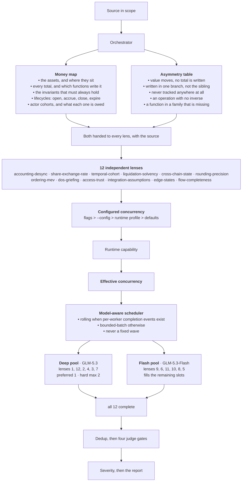

# 0xSimao AI

<p align="center">
  <picture>
    <source media="(prefers-color-scheme: dark)" srcset="img/0xsimao_signature_white_500x500_no_bg.png">
    <source media="(prefers-color-scheme: light)" srcset="img/0xsimao_signature_black_500x500_no_bg.png">
    
  </picture>
</p>

[0xsimao.com](https://0xsimao.com/)

[Request an Audit](https://t.me/OxSimao)

---

Accounting-first Solidity security audit skill, built from 0xSimao's 869 published findings (177 High, 247 Medium) across 143 reviews.

This does not replace a manual audit. Use it to catch issues early and to arrive at a review with a cleaner codebase. For a manual audit, contact 0xSimao on [Telegram](https://t.me/OxSimao).

## What it does differently

Most audit tooling scans for bad lines. This one writes down the protocol's accounting model first, then attacks it.

The ordering comes from the findings themselves. About a third of the High findings share one shape: value leaves the contract but the variable tracking it is never decremented, or it gets decremented in one branch of an `if` and not in the sibling branch. Early actors over-withdraw and whoever withdraws last cannot be paid. That bug is not visible line by line. It shows up once you have listed every function that writes every tracked total and asked who is left holding the loss.

## How it runs



1. Money map. The orchestrator reads the source and writes out assets, tracked totals, the asymmetry table, invariants, lifecycles and actor cohorts. Around 200 lines, injected into every lens.
2. Twelve independent lenses, scheduled through a configurable bounded-concurrency pool. The default is three active subagents; when one completes, the next eligible lens immediately takes its slot. Each lens is a separate subagent with the full source, the money map, the method and its own specialty. No lens sees another lens's output, so two lenses landing on the same bug means something.
3. Dedup. Hard gates for function isolation, mechanism preservation, mitigation preservation and completeness.
4. Judge. Four gates, then severity calibration.
5. Report. `Description` and `Recommended Mitigation` per finding.

## The lenses

| # | Lens | Owns |
|---|---|---|
| 1 | accounting-desync | tracked totals drifting from reality, the largest class |
| 2 | share-exchange-rate | claims vs value, round-trip profit, redemption in terminal states |
| 3 | temporal-cohort | who gets the distribution, join-before / leave-before, index checkpoints |
| 4 | liquidation-solvency | health math, blocked liquidations, bad-debt clearing |
| 5 | cross-chain-state | LayerZero/CCIP global-state overwrite, debited-here-credited-nowhere |
| 6 | rounding-precision | direction, truncation, decimals, casts, overflow |
| 7 | ordering-mev | init races, unprotected protocol swaps, discrete-jump arbitrage |
| 8 | dos-griefing | unbounded loops, poisoned batches, pause interactions |
| 9 | access-trust | callbacks, approval abuse, unvalidated targets, composed privilege |
| 10 | integration-assumptions | token quirks, oracles, external protocols, chain environment |
| 11 | edge-states | zero, one, first, last, expired, paused, capped |
| 12 | flow-completeness | the gap hunter: missing calls, asymmetric branches, absent siblings |

## Scheduling and model routing

The 12 lenses never launch as one unrestricted wave. They run through a bounded-concurrency pool:

- **Default requested concurrency is 3**, clamped by runtime capability to an **effective concurrency** (printed as `requested/effective` when they differ). Any integer `1..12` is a valid concurrency; class limits are clamped to the effective value, so `--concurrency 1` works. With per-worker completion events the pool is rolling — any completion immediately frees its slot and the next eligible lens starts. Without them the scheduler reports **bounded-batch** mode and still never exceeds the effective concurrency. It is never fixed-wave batching.
- Concurrency is configurable: `--concurrency N` (1–12) or a `--config` file. A `.0xsimao-ai.json` in the audited repo is applied only by explicit opt-in (`--config .0xsimao-ai.json`) — audit-target configuration is untrusted.
- On runtimes that can pin a model per subagent, lenses are model-routed, and caps are enforced against the **resolved** model — a lens pinned directly to `GLM-5.3` counts against the Deep cap even if its class says `fast`. The ZCode default profile:

| Model | Lenses | Concurrency |
|---|---|---|
| GLM-5.3 | 1, 2, 3, 4, 7, 12 — the lenses that profit most from deeper multi-step reasoning | preferred 1, hard max 2 |
| GLM-5.3-Flash | 5, 6, 8, 9, 10, 11 — the systematic / enumerative lenses | fills the other slots |

- **Default model for an unspecified ZCode lens: GLM-5.3-Flash.** New or unassigned lenses never silently land on the expensive class.
- Normal initial spawn is one GLM-5.3 + two GLM-5.3-Flash. While Flash work remains, the scheduler keeps a single GLM-5.3 active; once Flash work drains, up to two GLM-5.3 workers run — with the default cap of 3, never all three slots.
- Execution failures are bounded to two attempts per lens (initial run + one retry); a spawn the runtime refuses never consumes an attempt. If a lens ends FAILED, the audit stops instead of reporting 11/12.
- Runtimes without per-subagent model selection still run all 12 independent lenses at the configured concurrency, on the runtime's default model, with one concise notice.

Defaults live in [`references/orchestration-defaults.json`](references/orchestration-defaults.json), strictly validated against [`references/orchestration.schema.json`](references/orchestration.schema.json) (unknown keys fail before any lens spawns). The ZCode worker definitions and install notes live in [`integrations/zcode/`](integrations/zcode/). Config precedence, lowest → highest: defaults file → runtime profile → `--config` file → invocation flags; a repo-local `.0xsimao-ai.json` is never implicit.

## Install

Works with any coding agent that can run a shell, read files and spawn subagents. `SKILL.md` is plain markdown with no vendor tool names or APIs in it. Per-lens model routing additionally needs a runtime that can pin a model per subagent — see [`integrations/zcode/`](integrations/zcode/) for the ZCode adapter. Every other feature, including the bounded rolling scheduler, works on any runtime.

Paste this into your agent, whichever one you use:

```
Install the 0xSimao AI audit skill:

1. git clone https://github.com/0xsimao/0xsimao-ai.git ~/0xsimao-ai
2. Work out where YOU load instructions from: your own skills folder,
   rules directory, or instructions file. If you have a skills or plugins
   directory, copy the clone into it under the name `0xsimao-ai`.
   Otherwise append to whichever instructions file you already read:

   When asked to run "0xSimao AI", "0xSimao audit", or to audit Solidity
   for security, read ~/0xsimao-ai/SKILL.md and follow it exactly.

3. Tell me where you installed it and how to invoke it from now on.
```

Your agent knows its own config layout, so it can pick the location without this README guessing at it. Ask for a user-level install to get the skill in every project, or project-level to scope it to one repo.

To update: `run 0xSimao AI update`, or `cd ~/0xsimao-ai && git pull`.

If that fails, or your agent has no plugin system, skip the install and say this in the repo you want audited:

```
Read ~/0xsimao-ai/SKILL.md and follow it to audit this codebase
```

Everything above only saves you from retyping that line. Pasting the contents of `SKILL.md` into the chat works as well.

## Usage

```
run 0xSimao AI                              # full repo, default concurrency 3
run 0xSimao AI on Vault.sol                 # specific files
run 0xSimao AI --file-output                # also write the report to disk
run 0xSimao AI --concurrency 1              # one lens at a time (valid)
run 0xSimao AI --concurrency 3              # default: three lenses active
run 0xSimao AI --concurrency 5              # five lenses active at once
run 0xSimao AI --config /trusted/path/audit-config.json   # explicit config
run 0xSimao AI --config .0xsimao-ai.json    # explicit opt-in to the repo-local config
run 0xSimao AI Vault.sol --concurrency 2    # combine freely
```

The 12 lenses run through a bounded pool (default: 3 active subagents, rolling refill when the runtime supports it) over the in-scope source. Token spend is significant on a large codebase, so scope to specific files while iterating.

Repo-local overrides can live in a `.0xsimao-ai.json` at the audited repo root — but the audit target is untrusted, so the file is never loaded automatically. Apply it only when you trust it, by passing it explicitly:

```json
{
  "maxConcurrency": 4,
  "lensAssignments": { "5": { "modelClass": "deep" } }
}
```

Configuration is deep-merged over the defaults (a partial lens override keeps the default `priority` and the other 11 lenses), unknown keys fail before any lens spawns, and class limits are clamped to the effective concurrency.

Agents that cannot spawn subagents fall back to running the twelve lenses one after another in a single context. Slower, and the lenses lose their independence, but the method still holds.

## Benchmark

Sherlock's [DODO Cross-Chain DEX](https://audits.sherlock.xyz/contests/991) contest, 1,632 nSLOC, 17 judged issues (5 High, 12 Medium). Audited at the judged commit with the findings held out of every agent's context.

| | Recall | Runtime | Tokens |
|---|---|---|---|
| 0xSimao AI | 15/17 (88.2%) | ~11 min (historical benchmark using the original 12-way parallel scheduler) | ~1.1M |
| pashov solidity-auditor v3 | 14/17 (82.4%) | 19–28 min | 3.3–4.8M |

The `~11 min` figure was obtained under the old unrestricted 12-way parallel scheduler. The current scheduler defaults to max concurrency 3 and uses model-aware routing, so the historical runtime is not representative of the current wall-clock duration. Re-benchmark before publishing a replacement runtime.

This is not a head-to-head. The second row is there for scale. The two tools were run by different people at different times, each scored by its own author, with no shared harness. The claim being made is only that the skill finds real issues in a real contest at a useful rate.

Both numbers are self-reported. Recall is also the easier half of the problem, since neither figure says anything about precision. One run, one contest.

A rerun could invert the numbers. One run of a stochastic twelve-agent pipeline is a sample of size one. Run the same skill against the same commit again and it can miss what it caught and catch what it missed. The same applies to the other tool. Any single score here is evidence that the approach works, not a ranking.

The failure pattern is more interesting than the score. The run caught the two rarest issues in the set, submitted by 4 and by 7 of the 136 auditors credited in the judged report, and missed one that 13 auditors found. These tools do not fail uniformly. They fail unpredictably, which is why a quiet report is not the same thing as coverage.

## Layout

```
SKILL.md                              orchestrator
references/
  simao-method.md                     the 7-phase method, how to think
  severity-calibration.md             four gates + severity assignment
  report-formatting.md                the report format
  orchestration-defaults.json         scheduler + model-routing defaults
  orchestration.schema.json           strict config schema (typos fail)
  attack-lenses/
    shared-rules.md                   output format + trust boundary
    <12 lens files>
integrations/
  zcode/                              ZCode runtime adapter
    README.md                         install notes + model routing
    agents/0xsimao-deep.md            GLM-5.3 lens worker (read-only)
    agents/0xsimao-fast.md            GLM-5.3-Flash lens worker (read-only)
scripts/
  validate-orchestration.py           config validator + scheduler simulator
.github/workflows/
  validate-orchestration.yml          CI: runs the validator
```

## Notes

Every attack surface in every lens is backed by verbatim titles from real findings. Keep that up when you extend a lens: add the pattern and the finding that proves it happens.
